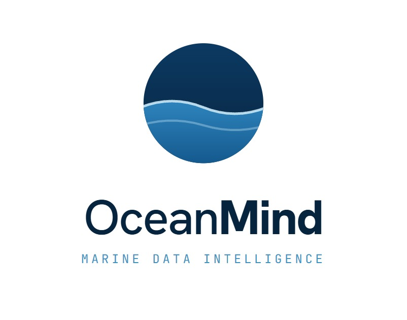
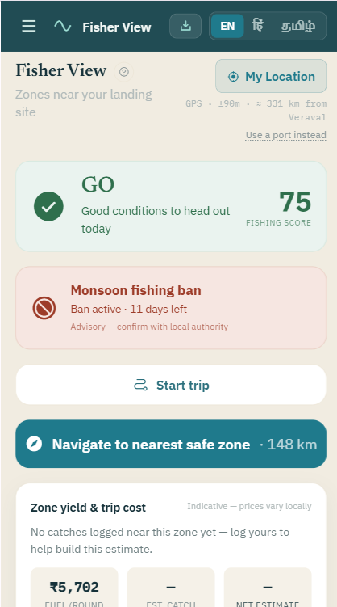
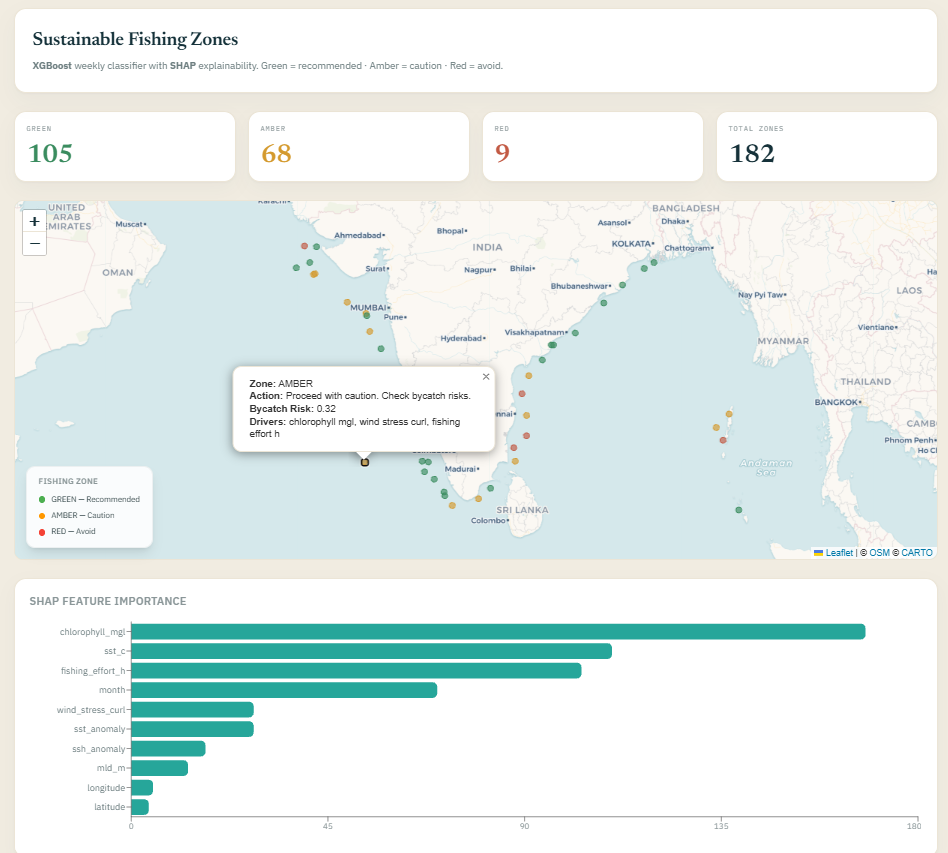
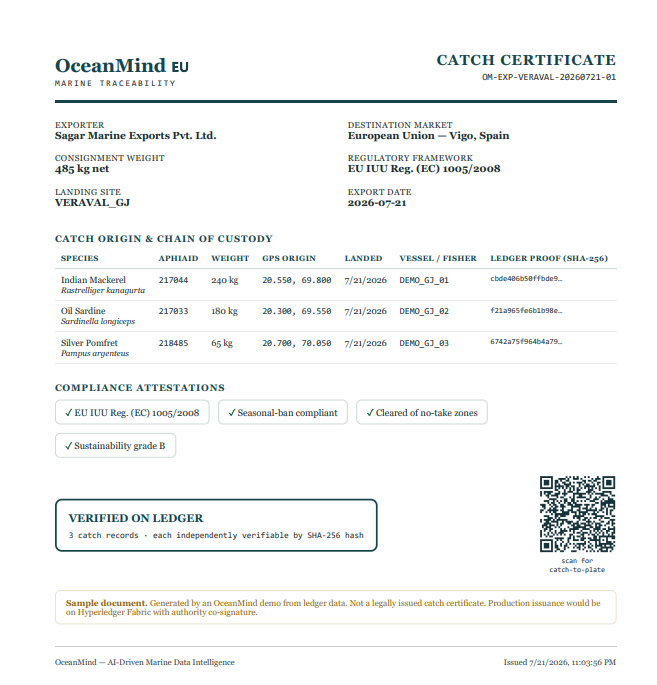
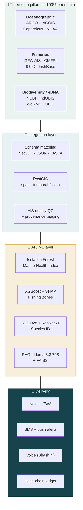

<div align="center">



# OceanMind

### AI marine intelligence that tells an Indian fisher where it's safe and worth fishing today — and turns his catch into an export certificate that pays for the platform.

<br>

[](https://fastapi.tiangolo.com)
[](https://nextjs.org)
[](https://python.org)
[](https://postgis.net)
[](#-license)

**Biothon 2026** · Environment &amp; Biodiversity · Dept. of Bioinformatics, Marwadi University
Built by [Atharv (AtharvK-28)](https://github.com/AtharvK-28) &amp; [Adi (Crriminson)](https://github.com/Crriminson) &amp; [Amberley (amberley25)](https://github.com/amberley25) &amp; [Gopika Menon]

</div>

---

## The one thing it answers

> A fisher's decision to sail costs **₹3 lakh** — fuel alone is ₹1.5 lakh for a three-day trip, **54% of his operating cost**. He makes that decision on a guess, at 4 a.m. **14.5 million** Indians make it every morning.

At the same time **35.5% of the world's fish stocks are overfished** (FAO 2025, 2,570 stocks assessed) and the Indian Ocean is among the fastest-warming basins on Earth. The fisher loses money and the ocean loses fish — from the same bad guess.

**OceanMind fuses three historically siloed data pillars — oceanographic sensor data, fisheries catch records, and molecular biodiversity (eDNA) — into one explainable AI layer**, then delivers it as a single word the fisher can act on: **GO**, **CAUTION**, or **AVOID** — by voice, in his language, before he burns a rupee of diesel.

---

## See it

<div align="center">
<table>
<tr>
<td width="33%" valign="top"></td>
<td width="33%" valign="top"></td>
<td width="33%" valign="top"></td>
</tr>
<tr>
<td align="center"><b>Fisher View</b><br><sub>One word from live sea state — plus the active ban and the trip's fuel cost.</sub></td>
<td align="center"><b>Fishing Zones + SHAP</b><br><sub>182 zones classified weekly. The model shows <i>why</i> each one is green.</sub></td>
<td align="center"><b>Catch Certificate</b><br><sub>EU IUU chain of custody — every line hash-verifiable.</sub></td>
</tr>
</table>
</div>

---

## What makes it different

India's INCOIS already publishes free Potential Fishing Zone advisories — and we'd happily consume them as a source. Three structural limits remain, and they're where OceanMind lives:

| | Today's satellite advisory | OceanMind |
|---|---|---|
| **Validity** | 24 hours, same-day satellite; cloud gaps, no forecast | Forecast-driven, re-classified weekly from live sea state |
| **Reasoning** | Tells you *where* — never *why* or *how much* | **SHAP attribution on every zone** — defensible in a policy hearing |
| **Reach** | Port name + lat/long, as text, in one language | One word by **voice, in Hindi &amp; Tamil** |
| **After the catch** | *Nothing* | **Hash-verified export certificate** — and the revenue model |

---

## Architecture



---

## The four AI models

Every prediction is explainable and every claim below is scoped honestly — this is a working MVP, not a production deployment.

| Model | Job | Why this model | Status |
|---|---|---|---|
| **Isolation Forest** | Marine Health Index (0–100) | Unsupervised — there is no ground-truth label for "ocean health"; it scores deviation from regional climatology across SST, chlorophyll, O₂, pH, salinity | ✅ Working |
| **XGBoost + SHAP** | Sustainable Fishing Zones | Tabular, 6 features — boosting beats deep nets here, and tree-SHAP gives *exact* feature attributions, not approximations | ⚠️ Trained on literature labels; not yet validated vs. real catch-per-unit-effort |
| **YOLOv8 + ResNet50** | Species ID from a catch photo | 13 species covering the majority of Indian landings by volume; resolves to a **WoRMS AphiaID** so a photo becomes joinable biodiversity data | ✅ Live inference |
| **ConvLSTM** | Migration forecast | Routes are **literature-derived waypoints** (CMFRI + IOTC tagging); +2 °C shift uses published Cheung et al. 2013 rates | 🚧 Architecture scaffolded, not yet trained on our own gridded series |

---

## Honest by design — what's live vs. synthetic

OceanMind ships a **`/trust` page** that states this publicly, in-product. We'd rather show you than have you find it.

| | Sources |
|---|---|
| 🟢 **Live right now** | Open-Meteo marine weather &amp; tides · YOLOv8 + ResNet50 vision inference · Llama 3.3 70B RAG (Groq) · WoRMS taxonomy · IUCN Red List status |
| 🟡 **Synthetic fallback today** | ARGO, Global Fishing Watch, INCOIS feeds — blocked on an API credential, not on engineering. Pipelines and schema are built and tested. |
| 🔴 **Not yet validated** | The zone classifier against real catch-per-unit-effort. That's what the pilot is for — and why fishers use the platform free. |

> Without live credentials the system runs in **offline fallback mode**: pre-trained `.pkl` artifacts + synthetic data matching the real schema, so the full API and dashboard stay demo-able. Set `FALLBACK_DATA_MODE=false` with keys in place to go fully live.

---

## Tech stack

| Layer | Technology |
|---|---|
| **Frontend** | Next.js 16 (React), PWA, Capacitor (Android), React-Leaflet, Recharts, Tailwind |
| **Backend** | FastAPI 0.111, Python 3.11, SQLAlchemy 2, psycopg3 |
| **Database** | PostgreSQL 15 + PostGIS 3.3 |
| **ML** | XGBoost, scikit-learn (Isolation Forest), SHAP, PyTorch (YOLOv8, ResNet50, ConvLSTM) |
| **RAG** | LangChain · Groq Llama-3.3-70B (OpenRouter fallback) · sentence-transformers · FAISS |
| **Geospatial** | GeoAlchemy2, Shapely, Leaflet |
| **Alerts / Voice** | Twilio SMS + Firebase FCM (Phase 2) · Bhashini (Hindi, Tamil) |
| **Traceability** | SHA-256 hash chain (MVP) → Hyperledger Fabric 2.5 (Phase 2) |

---

## Quick start

**Prerequisites:** Python 3.11+, Node 18+, Docker (optional, for PostGIS). A [Groq](https://console.groq.com) or [OpenRouter](https://openrouter.ai) key powers RAG answers — everything else runs without credentials.

```bash
git clone https://github.com/AtharvK-28/OceanMind.git
cd OceanMind
cp .env.example .env          # optional: add GROQ_API_KEY for live RAG answers
```

**Backend** (runs in offline-fallback mode out of the box):

```bash
pip install -r requirements.txt
uvicorn backend.main:app --host 0.0.0.0 --port 8000
# API      → http://localhost:8000
# Swagger  → http://localhost:8000/docs
```

**Frontend** (separate terminal):

```bash
cd frontend-react
npm install
npm run dev
# Dashboard → http://localhost:3000
```

<details>
<summary><b>Alternative: Docker Compose · Makefile shortcuts</b></summary>

```bash
# PostGIS + FastAPI backend together
docker compose up --build -d

# Or use the Makefile
make setup      # create venv + install
make db         # PostGIS only
make api        # FastAPI with hot-reload
make frontend   # Next.js dev server
```
</details>

<details>
<summary><b>Share the running demo over HTTPS (phone / judges)</b></summary>

The browser calls the backend client-side, so expose **both** ports and pass the backend URL via the built-in `?api=` override:

```bash
cloudflared tunnel --url http://localhost:3000   # frontend
cloudflared tunnel --url http://localhost:8000   # backend
# then open:  https://<frontend>.trycloudflare.com/?api=https://<backend>.trycloudflare.com
```

CORS already whitelists `*.trycloudflare.com` outside production. TLS is terminated at Cloudflare's edge — no certificate setup needed.
</details>

---

## Business model — the fisher never pays

He's the **supply side** of a data flywheel: every catch he logs is ground truth that sharpens the next advisory. Three parties pay, and the primary one already carries the cost as a legal obligation.

| Tier | Price | Who |
|---|---|---|
| 🏅 **Exporter Traceability** *(primary revenue)* | **₹100** / verified certificate · or ₹25k/mo | Seafood exporters — EU IUU Reg. **(EC) 1005/2008** already forces catch certificates via MPEDA |
| **Institution Pro** | **₹2.5 L** / year | Universities, labs, consultancies — REST API + bulk data |
| **Government** | Custom, per district | State fisheries departments |

**Market:** India exported **₹60,523 crore** of seafood in FY24, none of which reaches the EU without a catch certificate. **Distribution:** the National Fisheries Digital Platform already has **26 lakh** registered fishers. **Run cost:** ~₹25,000/month, because every input is open data — break-even at ~250 certificates.

---

## API

Full interactive docs at **`/docs`** (Swagger UI). Selected endpoints:

| Endpoint | Method | Description |
|---|---|---|
| `/api/v1/mhi/status` | GET | Marine Health Index grid for the Indian EEZ |
| `/api/v1/sfz/current` | GET | Weekly Sustainable Fishing Zones GeoJSON + SHAP |
| `/api/v1/sfz/classify` | POST | Classify a single location with SHAP breakdown |
| `/api/v1/cv/analyze` | POST | YOLOv8 + ResNet50 species ID + length/weight estimate |
| `/api/v1/edna/analyze` | POST | eDNA metabarcoding + diversity indices |
| `/api/v1/migration/forecast` | GET | Species migration routes + climate-shift projection |
| `/api/v1/rag/query` | POST | Natural-language marine query with provenance |
| `/api/v1/voice/query` | POST | Bhashini voice: STT → RAG → TTS (Hindi/Tamil/English) |
| `/api/v1/digital-twin/scenario` | POST | Marine-heatwave scenario engine (SST perturbation) |
| `/api/v1/trace/catch` | POST | Log a catch to the hash-chain ledger |
| `/api/v1/fishing/advisory` | GET | Live GO/CAUTION/AVOID from Open-Meteo marine data |

<details>
<summary><b>Full endpoint list (20 routes)</b></summary>

| Phase | Endpoint | Method | Description |
|-------|----------|--------|-------------|
| A | `/api/v1/data/bubble?bubble_id=N` | GET | Unified multi-source join via Data Bubble |
| B | `/api/v1/cv/analyze` | POST | YOLOv8 landing-site fish species ID + length estimation |
| B | `/api/v1/cv/species-reference` | GET | WoRMS-validated species reference list |
| B | `/api/v1/edna/analyze` | POST | eDNA metabarcoding pipeline + diversity indices |
| C | `/api/v1/mhi/status` | GET | MHI grid scores for Indian EEZ |
| C | `/api/v1/mhi/score` | POST | Single-point MHI score |
| C | `/api/v1/migration/forecast` | GET | Migration routes with confidence bands |
| D | `/api/v1/sfz/current` | GET | Weekly SFZ GeoJSON + SHAP |
| D | `/api/v1/sfz/classify` | POST | Classify single location |
| E | `/api/v1/rag/query` | POST | Natural language marine query + provenance |
| F | `/api/v1/alerts/subscribe` | POST | Register for SMS/FCM alerts |
| F | `/api/v1/alerts/trigger-demo` | GET | Demo zone-change alert |
| F | `/api/v1/voice/query` | POST | Bhashini voice: STT → RAG → TTS |
| F | `/api/v1/voice/languages` | GET | Supported voice languages |
| G | `/api/v1/digital-twin/scenario` | POST | MHW scenario engine (SST perturbation) |
| G | `/api/v1/digital-twin/presets` | GET | IPCC/MHW scenario presets |
| H | `/api/v1/trace/catch` | POST | Log catch to ledger |
| H | `/api/v1/trace/verify/{tx_id}` | GET | Verify transaction |
| H | `/api/v1/trace/chain-summary` | GET | Ledger statistics |
| H | `/api/v1/trace/history` | GET | Catch history (filterable by landing site) |

</details>

---

## Data sources — all open, all FAIR

<table>
<tr>
<td valign="top" width="33%">

**🌊 Oceanographic**
ARGO GDAC
INCOIS
Copernicus CMEMS
NASA PODAAC
NOAA WOD23 · IMD

</td>
<td valign="top" width="33%">

**🎣 Fisheries**
GFW AIS (effort)
CMFRI FCSA
IOTC catch-and-effort
FAO FishBase

</td>
<td valign="top" width="33%">

**🧬 Biodiversity / eDNA**
NCBI SRA + GenBank
IndOBIS · OBIS
BOLD · GBIF
TARA Oceans

</td>
</tr>
</table>

Species records resolve to canonical **WoRMS AphiaIDs**; eDNA uses the **12S MiFish** marker with BLAST+ against NCBI plus a 1D-CNN for novel sequences, reporting Shannon, Simpson and Pielou indices per sample.

---

## Testing

```bash
# No database required for phases B–H
python tests/test_phase_b_and_g.py
python tests/test_phase_c_d_e_f_h.py

# Phase A (requires running PostGIS)
python tests/test_phase_a.py
```

---

<details>
<summary><b>📁 Project structure</b></summary>

```
OceanMind/
├── backend/
│   ├── main.py               # FastAPI app — all endpoints
│   ├── db/                   # PostGIS schema + connection
│   ├── ingestion/            # ARGO · INCOIS · GFW pipelines
│   ├── models/               # MHI · SFZ · blockchain + .pkl artifacts
│   ├── processing/           # AIS quality · PostGIS data bubbles
│   └── rag/                  # LangChain + Groq + FAISS RAG
├── frontend-react/
│   ├── src/app/              # Next.js App Router (22 routes)
│   ├── src/components/       # UI, maps, layout
│   └── src/lib/              # API client, i18n, constants
├── tests/                    # Phase A–H integration tests
├── docs/                     # PRD · TRD · Implementation Plan
└── docker-compose.yml
```
</details>

---

## Roadmap

- **Phase 2** — Live GFW/ARGO ingestion · Hyperledger Fabric ledger · Twilio + FCM dispatch · Bhashini 22 languages · trained ConvLSTM
- **Phase 3** — National scale: all 586 INCOIS landing centres · one base model + regional fine-tuning heads (Arabian Sea / Bay of Bengal) · socioecological agent-based modelling · carbon-credit integration

---

## References

- FAO — *Review of the State of World Marine Fishery Resources 2025* (2,570 stocks)
- Hazen et al. 2018 — Dynamic ocean management (*Science Advances* 4)
- Shedrawi et al. 2024 — Ikasavea landing-site CV (*Scientific Reports* 14)
- Agmata &amp; Guðmundsson 2025 — ConvLSTM CATCH architecture (*Biology Methods &amp; Protocols* 10)
- Cheung et al. 2013 — Species range shifts under warming (*Nature* 497)
- Fernandes-Salvador et al. 2026 — Trustworthy AI for marine management (*Fish and Fisheries*)

---

## License

Released under the **MIT License** — see [`LICENSE`](LICENSE). All data sources are publicly accessible; OceanMind is advisory and insight-only by design (it never controls a vessel or auto-files to any government portal).

<div align="center">
<br>
<sub><b>OceanMind v1.0</b> · Biothon 2026 · Made for the 14.5 million Indians who ask one question every morning: <i>where should I go today, and is it safe?</i></sub>
</div>
